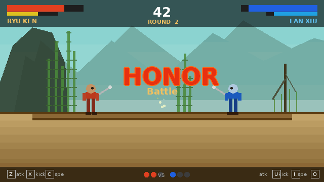

<div align="center">



# HONOR Battle

**2D multiplayer fighting game built in C with SDL2 on Ubuntu**


</div>

---

## Overview

**HONOR Battle** is a 2D fighting game developed entirely in **C** using the **SDL2** library on **Ubuntu**. It features a complete character management system, smooth sprite animations, real-time collision detection, and a local 2-player versus mode — all running natively on Linux.

The game is set in an ancient Asian-inspired world with hand-crafted backgrounds, animated title screens, and a full HUD including health bars, stamina, round counter, and timer.

---

## Features

### Character System
- Full character struct with HP, stamina, position, velocity, direction and state
- Sprite sheet animation system — idle, walk, attack, kick, special, hurt, death
- Frame-based animation controller with configurable speed per state
- Mirror/flip support for facing direction (left / right)

### Combat
- Attack, kick and special move inputs
- Hit detection using AABB collision boxes per animation frame
- Damage calculation with knockback physics
- Stamina cost per action — regenerates over time
- Combo system — chain attacks within a time window

### Multiplayer (local)
- 2-player simultaneous input on the same keyboard
- Player 1 : `Z` attack · `X` kick · `C` special · `WASD` move
- Player 2 : `U` attack · `I` kick · `O` special · arrow keys move
- Round system : best of 3, with win/loss tracking

### HUD & UI
- Real-time HP bars with colour transition (green → yellow → red)
- Stamina bar per player
- Countdown timer (60 seconds per round)
- Round indicator and score pips
- Animated title screen — letter-by-letter reveal (t1 → t30 frames)
- Loading screen with animated progress bar (s2 → s18 frames)

### Map & Rendering
- Parallax scrolling background (sky, mountains, mist layer)
- Tile-based ground platform
- Animated bamboo and willow trees
- Bamboo forest map (`fonj.png`) as the main arena
- Sprite-based rendering pipeline using SDL2 renderer


## Prerequisites

```bash
sudo apt update
sudo apt install gcc make libsdl2-dev libsdl2-image-dev libsdl2-ttf-dev libsdl2-mixer-dev
```

---

## Build & Run

```bash
# Clone the repository
git clone https://github.com/YOUR_USERNAME/honor-battle-2d.git
cd honor-battle-2d

# Build
make

# Run
./honor_battle
```

```bash
# Clean build files
make clean
```

---

## Controls

| Action | Player 1 | Player 2 |
|--------|----------|----------|
| Move left | `A` | `←` |
| Move right | `D` | `→` |
| Jump | `W` | `↑` |
| Crouch | `S` | `↓` |
| Attack | `Z` | `U` |
| Kick | `X` | `I` |
| Special | `C` | `O` |

---

## Technical Stack

| Component | Technology |
|---|---|
| Language | C (C99) |
| Graphics & Input | SDL2 |
| Image loading | SDL2\_image |
| Font rendering | SDL2\_ttf |
| Audio | SDL2\_mixer |
| Platform | Ubuntu Linux |
| Build system | Makefile / GCC |

---

## Key Concepts Implemented

- **Finite state machine** for each character (idle, running, attacking, hurt, dead)
- **Delta-time physics** for frame-rate independent movement
- **AABB hit boxes** loaded per animation frame from a config file
- **Double-buffered rendering** with SDL2's hardware-accelerated renderer
- **Asset manager** — sprites and fonts loaded once, referenced by ID
- **Event-driven input** mapped to player actions via configurable key bindings

---

## Roadmap

- [ ] Network multiplayer (TCP sockets)
- [ ] Additional characters with unique move sets
- [ ] Sound effects and background music
- [ ] High score / win statistics saved to file
- [ ] Character select screen

---

## Team

Developed by **MISSION POSSIBLE**

> "Honor is not won with words — it is earned in battle."

---

## License

MIT License — see `LICENSE` for details.
